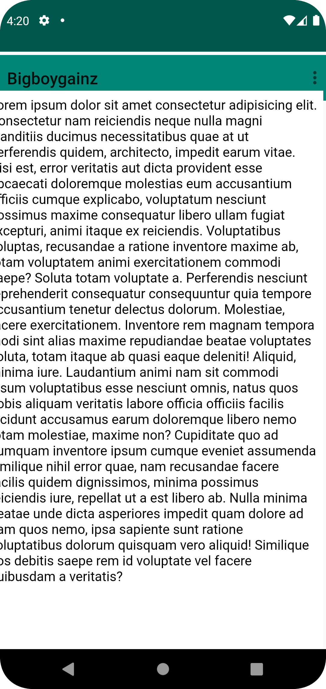

# Rapport

För att få webviewen att fungera så måste först en variabel med värdet WebView skapas. Sedan väljer vi vilken URL vi vill skicka användaren till.

    WebView myWebView;
    myWebView = findViewById(R.id.my_webview);
    myWebView.setWebViewClient(new WebViewClient()); // Do not open in Chrome!
    myWebView.loadUrl("https://google.se");
    WebSettings webSettings = myWebView.getSettings();
    webSettings.setJavaScriptEnabled(true);

Först började jag med att lägga in kod i de två funktionerna för att kunna visa både den interna och den externa sidan. Vi använder oss av samma kod för 
myWebView där den laddar olika URL:er beroende på om funktionen external eller internal webpage kallas.


    public void showExternalWebPage(){
        // TODO: Add your code for showing external web page here
        myWebView.loadUrl("https://youtube.se");
    }

    public void showInternalWebPage(){
        // TODO: Add your code for showing internal web page here
        myWebView.loadUrl("file:///android_asset/about.html");
    }

Nästa steg var att i if-satserna kalla på de respektive funktionerna för internal och external så att knapparna inne i applikationen kan leda oss till 
våra URL:s beroende på om vi valt external eller internal.

        if (id == R.id.action_external_web) {
            Log.d("==>","Will display external web page");
            showExternalWebPage();
            return true;
        }

        if (id == R.id.action_internal_web) {
            Log.d("==>","Will display internal web page");
            showInternalWebPage();
            return true;
        }

Ett annat steg som var nödvändigt för att få en internal html-fil i en mobilapp så behövde man först skapa ett assets folder där man sedan skapar en html-fil
som sedan kallas av funktionen med file-pathen file:///android_asset/about.html.
För att få applikationen att kopplas till internet så måste <uses-permission android:name="android.permission.INTERNET" /> läggas in xml-filen "AndroidManifest"
vilket gör att appen kan kopplas till internet.





## Följande grundsyn gäller dugga-svar:

- Ett kortfattat svar är att föredra. Svar som är längre än en sida text (skärmdumpar och programkod exkluderat) är onödigt långt.
- Svaret skall ha minst en snutt programkod.
- Svaret skall inkludera en kort övergripande förklarande text som redogör för vad respektive snutt programkod gör eller som svarar på annan teorifråga.
- Svaret skall ha minst en skärmdump. Skärmdumpar skall illustrera exekvering av relevant programkod. Eventuell text i skärmdumpar måste vara läsbar.
- I de fall detta efterfrågas, dela upp delar av ditt svar i för- och nackdelar. Dina för- respektive nackdelar skall vara i form av punktlistor med kortare stycken (3-4 meningar).
```

Bilder läggs i samma mapp som markdown-filen.


Läs gärna:

- Boulos, M.N.K., Warren, J., Gong, J. & Yue, P. (2010) Web GIS in practice VIII: HTML5 and the canvas element for interactive online mapping. International journal of health geographics 9, 14. Shin, Y. &
- Wunsche, B.C. (2013) A smartphone-based golf simulation exercise game for supporting arthritis patients. 2013 28th International Conference of Image and Vision Computing New Zealand (IVCNZ), IEEE, pp. 459–464.
- Wohlin, C., Runeson, P., Höst, M., Ohlsson, M.C., Regnell, B., Wesslén, A. (2012) Experimentation in Software Engineering, Berlin, Heidelberg: Springer Berlin Heidelberg.
